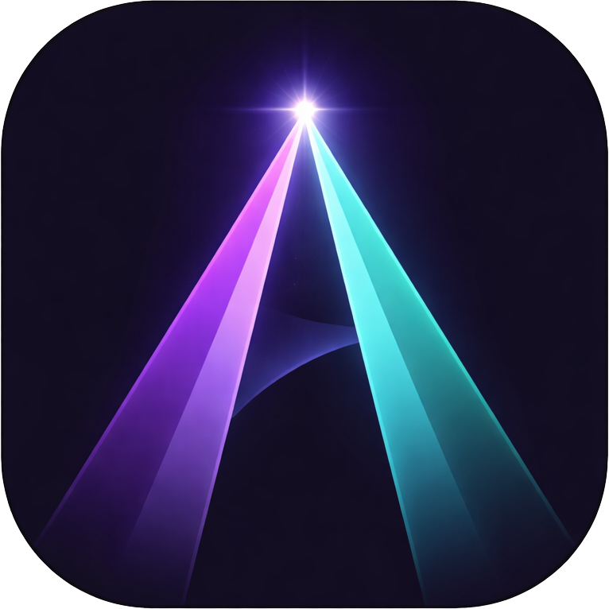
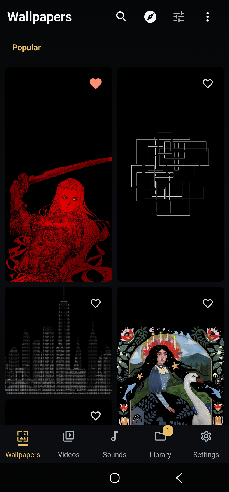

<p align="center">
  
</p>

<h1 align="center">Aura</h1>


<p align="center">
  <a href="https://ko-fi.com/X8K126YVER">
    
  </a>
</p>

<p align="center">
  <sub><em>If Aura helps you personalize your phone without ads, a coffee helps me keep the app tested and maintained.</em></sub>
</p>

> Open-source alternative to Zedge: wallpapers, video wallpapers, ringtones, and sounds for Android. **YouTube integration, yt-dlp powered.**



## What Makes Aura Different

Aura is built as a local-first tool rather than an ad-and-credit marketplace:

| Area | Aura behavior |
|------|---------------|
| **Advertising** | No ad SDK, sponsored placements, or cross-app tracking. |
| **Account** | Browsing, downloading, editing, applying, and backing up content do not require an Aura account; community features use an anonymous app identity. |
| **Credits and paywalls** | No Aura credit balance, subscription, or in-app paywall. In full builds, optional Stability AI generation uses the user's own provider key and may consume Stability credits. |
| **AI-generated content** | Generation is off by default in full builds and omitted from FOSS builds. Declared AI uploads are labeled, Aura-generated uploads are labeled automatically, and community feeds provide a Hide AI filter. |
| **Offline library** | Downloads and offline favorites stay on the device for local use. Missing or moved files keep their library metadata and can be relinked. Portable backups carry the local media identity and technical details without exporting private paths or media bytes. |

- **Sounds that work offline**: 25 Aura Originals ship with the app, then quality-ranked YouTube results add more ringtones, notifications, and alarms when connected.
- **Reddit-first discovery**: mobile wallpaper and motion communities lead the home feeds, with real cached Atom cursor pagination instead of a fixed recent slice.
- **Video wallpapers from multiple sources**: browse Reddit live wallpapers and cinemagraphs first, followed by YouTube and optional Pixabay or Pexels results. Local video and GIF import includes loop, crop, Fill, and Fit Canvas controls.
- **More ways to personalize**: Reddit RSS leads the network feeds. Wallhaven, Bing, Pexels, Pixabay, YouTube, Aura Originals, local files, and community uploads add user-controlled choices.
- **Fast, bounded feeds**: Discover metadata and a 256 MB image disk cache make repeat visits immediate, while the foreground bitmap cache stays capped at 12.5 percent of app memory.
- **Performance proof path**: Baseline Profile and Macrobenchmark tests cover startup, Wallpaper Detail, and the main media grids during local physical-device checks.
- **5 bottom nav tabs**: Wallpapers, Videos, Sounds, Library, Settings.

## Installing Aura

Every release ships one APK per CPU architecture plus a universal one, and a
single `SHA256SUMS.txt` covering all of them, on the same
[GitHub Release](https://github.com/SysAdminDoc/Aura/releases).

Pick the one that matches your phone. Almost every Android phone made since 2017
is `arm64-v8a`, and that build is roughly a third the size of the universal one
because it carries native code for one architecture instead of four. `armeabi-v7a`
is for older 32-bit devices; the `x86` builds are for emulators. If you are not
sure, the universal APK installs anywhere. Obtainium picks the right one on its
own with `autoApkFilterByArch` enabled, which the bundled
[`obtainium.json`](obtainium.json) already sets.

Do not install debug or third-party re-signed builds.

FOSS store builds omit the Stability AI generator, its provider key field, and
Firebase-backed community features. Full GitHub builds retain those optional
features, with generation disabled until the user enables it and accepts its
disclosure.

Verify the download, then install or update it with ADB:

```powershell
Get-FileHash .\Aura-vX.Y.Z-versionCode-N-arm64-v8a-release.apk -Algorithm SHA256
adb install --user 0 -r .\Aura-vX.Y.Z-versionCode-N-arm64-v8a-release.apk
```

Compare the printed digest with `SHA256SUMS.txt` before installing. The `-r`
update keeps app data only when the installed app and new APK use the same
signing certificate. If Android reports a signature mismatch, obtain the
official matching Aura build; uninstalling would erase local app data.

Official Aura builds are signed with this certificate:

```text
SHA-256: F2:8E:44:BE:A3:2F:5B:28:90:C8:26:8B:7F:BE:D4:3C:44:A4:D6:71:A5:12:FB:07:EB:F1:8F:DD:41:C6:6E:5A
```

Every release since v6.38.1 carries it. Check it with
`apksigner verify --print-certs <apk>` or with
[AppVerifier](https://github.com/soupslurpr/AppVerifier) before installing a
build you did not download from Aura's own releases page. A different digest
means a re-signed APK, whatever the version number says.

Android's developer-verification rollout begins on September 30, 2026 for
participating stores in Brazil, Indonesia, Singapore, and Thailand, then expands
globally in 2027. Unregistered APKs remain installable through ADB. Android is
also launching a one-time advanced flow in August 2026 for power users who
enable developer mode, acknowledge the security warnings, and complete its
24-hour waiting period. Follow the on-device advanced flow when the normal
package installer declines an unregistered APK; the wait does not apply to ADB.
See Android's [verification FAQ](https://developer.android.com/developer-verification/guides/faq)
and Aura's [verification decision record](docs/distribution/developer-verification.md).

## Quick Start

```bash
git clone https://github.com/SysAdminDoc/Aura.git
cd Aura
```

Open in Android Studio and run. Core browsing works out of the box; optional provider keys can be added later in Settings or `local.properties`.

YouTube extraction works without account credentials. For networks where YouTube
requires proof-of-origin tokens, Settings > Sounds > YouTube PO token provider
accepts the credential-free HTTPS base URL of a self-hosted
[bgutil provider](https://github.com/Brainicism/bgutil-ytdlp-pot-provider). Aura
ships its hash-pinned yt-dlp plugin but sends attestation data only after this
optional URL is configured; see yt-dlp's [PO Token Guide](https://github.com/yt-dlp/yt-dlp/wiki/PO-Token-Guide).

Choosing **Update yt-dlp** in Settings downloads a replacement executable at
runtime. Aura requires a separate confirmation that explains this bypasses
F-Droid or other repository review checks before the download can start.

## Privacy

Aura has no ads, no subscription, and no cross-app tracking. The public privacy
policy is tracked at [docs/privacy/privacy-policy.md](https://github.com/SysAdminDoc/Aura/blob/main/docs/privacy/privacy-policy.md);
the same link is available in Settings > About > Privacy policy.

## Features

| Feature | Description |
|---------|-------------|
| **HD/4K Wallpapers** | Reddit-first discovery with optional Wallhaven, Pexels, Pixabay, Bing, NASA, and Wikimedia results |
| **Wallpaper Quality Filters** | Discover chips for For You, AMOLED, 4K+, Portrait, and Icon Safe with curated ranking |
| **On-Device Style Learning** | Apply, favorite, and hide signals adapt Discover locally with a Settings reset control |
| **Community Wallpapers** | Upload phone-cropped gallery images with tags, Palette colors, and community voting |
| **HEIF/AVIF Wallpaper Import** | Local apply, editor, rotation, and community upload flows share one format policy with HEIF support and Android 14+ AVIF gating |
| **Creator Profiles** | View upload stats, votes, followed creators, followed uploads, and top creator leaderboard |
| **Shareable Collections** | Share wallpaper collections as Aura links, QR codes, or JSON files and import them on another device |
| **Video Wallpapers** | Browse YouTube video wallpapers with ExoPlayer auto-preview or import local clips/GIFs |
| **Video Feed Pagination** | Warm-cache loading and pagination share one request gate, so provider results aren't duplicated or dropped |
| **Video Quality Hints** | Loop-safe, low-battery, and phone-fit filters plus per-card motion hints |
| **Wallpaper Fit Canvas** | Keep the complete image, video, or GIF over AMOLED black, a chosen color, a Palette color, or a cached blurred edge. [Behavior and limits](docs/fit-canvas.md) are defined for transparent, HDR, missing-frame, and ultrawide media. |
| **Video Loop & Crop Editor** | Trim intros/outros with frame thumbnails, preview the loop, and convert landscape videos to portrait |
| **Video Battery Dashboard** | Live wallpaper-service heartbeat, battery status, effective FPS, and automatic low-battery capping |
| **Parallax Wallpapers** | ML Kit depth segmentation for layered tilt-responsive live wallpapers |
| **Weather Wallpapers** | Live weather effects overlay on wallpapers |
| **Shader Wallpapers** | Curated AGSL live wallpaper backgrounds with static fallback on older Android releases |
| **Live Wallpaper Instances** | Android 16 descriptions keep selected video, parallax, and weather settings with a legacy fallback on older releases |
| **Download Progress** | Download notifications use the Android 16 progress style when available and retain the compatibility progress bar elsewhere |
| **Saved Originals** | Downloads preserve source bytes and provenance. Apply creates a named device-compatible copy only when needed, then reuses it. [Storage behavior](docs/media-copy-lifecycle.md) is documented. |
| **Local Media Relink** | Missing, moved, corrupt, or permission-revoked media remains visible with a Relink action. Aura checks type and technical details before replacing the locator, while keeping favorites, collections, history, rotation choices, tags, and wallpaper targets. [Relink behavior](docs/local-media-relink.md) is documented. |
| **Touch-Reactive Effects** | Optional ripple and sparkle bursts on live wallpaper touches |
| **YouTube Sounds** | YouTube-first ringtone, notification, and alarm discovery with duration-aware searches powered by NewPipe + yt-dlp |
| **Aura Originals** | 25 small CC0 tones included for offline ringtone, notification, and alarm preview, download, and apply |
| **Community Sound Uploads** | Pick or record sounds, tag them, vote on community picks, and share via Firebase Storage |
| **Sound Source Badges** | Color-coded source indicators on every sound card |
| **Sound Quality Filters** | Best, Clean, Short, Calm, and Punchy filters with intent-aware badges |
| **Real-Time Waveform** | Mini waveform on each sound card tracks actual playback position |
| **Configurable Search** | Customize YouTube search queries and blocked words per sound tab |
| **Ringtones & Sounds** | Tab-based browsing: Ringtones (5-45s), Notifications (0-8s), Alarms (5-60s) |
| **Sound Editor** | Waveform trim, fades, pitch-preserving 0.5x to 2x speed, Media3 audio export, gapless OGG output, verified lossless cuts, and MP3/FLAC fallback encoding |
| **Wallpaper Editor** | Brightness, contrast, saturation, blur, depth portraits, and local text/sticker layers |
| **Crop & Position** | Pinch-zoom with aspect ratio presets (9:16, 16:9, 1:1) |
| **Collections** | Organize wallpapers into named folders with 2x2 cover previews |
| **Home Widget** | Glance-based widget for quick shuffle with error feedback |
| **Quick Settings Action** | Add “Next wallpaper” from the system tile editor for one-tap rotation, even while automatic rotation is off |
| **Auto Wallpaper** | Rotation schedule with one source, clock-based day/night sources, or system light/dark theme matching |
| **Rotation Exclusions** | Keep any wallpaper or video available for browsing and manual apply while leaving it out of automatic rotation. Undo is immediate, Settings can restore any item, and [library backups preserve the choice](docs/rotation-exclusions.md) without copying device paths. |
| **Shuffle FAB** | One-tap random wallpaper from current tab |
| **Per-Contact Ringtones** | Assign custom ringtones with DND priority guidance and a VIP-only silent-default preset |
| **Dual Wallpapers** | Coordinated home + lock screen wallpaper pairs |
| **Portable Library Backup** | Staged JSON export/import for favorites, collections, searches, packs, profiles, Fit Canvas defaults, rotation exclusions, local wallpaper metadata, and recent wallpaper history. Local paths and media bytes stay off the backup. Restored local records remain visible until the user relinks them. |
| **Theme Packs** | Local zip export/import for wallpaper, video, sound, widget tint, and launcher shortcut recipes |
| **Community Voting** | Upvote/downvote wallpapers and sounds via Firebase |
| **OLED Dark Theme** | Deep blacks, zero burn-in, Material 3 |

## External Automation

Aura exposes two optional broadcast actions for Tasker, MacroDroid, adb, and
Termux users:

```text
com.chloemlla.aura.action.ROTATE_NOW
com.chloemlla.aura.action.SHUFFLE_NOW
```

Enable them in Settings > Wallpaper rotation > External automation before
sending broadcasts. Aura ignores external broadcasts by default, accepts at most
one every 30 seconds, and records the last action plus the optional
`com.chloemlla.aura.extra.CALLER_PACKAGE` diagnostic extra in Settings > Diagnostics.
Broadcasts only enqueue the existing rotation worker, so charging, Wi-Fi, idle,
battery, Doze, and WorkManager quota can still delay the wallpaper change.
The same one-shot path powers the optional **Next wallpaper** Quick Settings
tile. Add it from Android's tile editor; its active state mirrors automatic
rotation, while tapping it still queues one wallpaper change when scheduling is off.

## Content Sources

<!-- provider-manifest:start -->
| Source | Media and role | Status | Access |
|---|---|---|---|
| [Reddit](https://reddit.com) | Wallpapers, Videos. Reddit-first mobile wallpapers and video wallpapers from public Atom feeds. | Active | No key; Full + FOSS; GitHub/Obtainium + Play |
| [YouTube](https://youtube.com) | Sounds, Videos. YouTube-first sound discovery and optional video wallpapers in GitHub and Obtainium builds. | Active | No key; Full + FOSS; GitHub/Obtainium |
| [Wallhaven](https://wallhaven.cc) | Wallpapers. HD and 4K wallpaper browsing and search with an optional key for account-level access. | Active | Optional key; Full + FOSS; GitHub/Obtainium + Play |
| [Aura Originals](https://github.com/SysAdminDoc/Aura/blob/main/docs/aura-originals-license.md) | Sounds. Twenty-five offline ringtones, notification sounds, and alarms included with Aura. | Active | No key; Full + FOSS; GitHub/Obtainium + Play |
| [Pexels](https://pexels.com) | Wallpapers, Videos. Photo and video browsing after the user adds a Pexels API key. | Active | User key required; Full + FOSS; GitHub/Obtainium + Play |
| [Pixabay](https://pixabay.com) | Wallpapers, Videos. Photo and video browsing after the user adds a Pixabay API key. | Active | User key required; Full + FOSS; GitHub/Obtainium + Play |
| [Bing Image of the Day](https://www.bing.com) | Wallpapers. Bing's daily image with its source and copyright details. | Active | No key; Full + FOSS; GitHub/Obtainium + Play |
| [Wikimedia Commons](https://commons.wikimedia.org) | Wallpapers. Wikimedia's Picture of the Day with author and license metadata. | Active | No key; Full + FOSS; GitHub/Obtainium + Play |
| [NASA APOD](https://apod.nasa.gov) | Wallpapers. Astronomy Picture of the Day and historical picks with photographer credit. | Active | No key; Full + FOSS; GitHub/Obtainium + Play |
| [Lemmy](https://lemmy.world) | Wallpapers. Community-voted wallpapers from public federated wallpaper communities. | Active | No key; Full + FOSS; GitHub/Obtainium + Play |
| [Aura Community](https://github.com/SysAdminDoc/Aura) | Wallpapers, Sounds. Opt-in community wallpaper and sound uploads with voting and reporting. | Community (opt-in) | No key; Full build; GitHub/Obtainium + Play |
| [Local device media](https://developer.android.com/training/data-storage/shared/photopicker) | Wallpapers, Videos, Sounds. Wallpapers, videos, and sounds selected from the device by the user. | Local | No key; Full + FOSS; GitHub/Obtainium + Play |
| [AI-generated](https://platform.stability.ai/legal) | Wallpapers. Prompt-created wallpapers after the user accepts the disclosure and supplies a provider key. | Generated (opt-in) | User key required; Full build; GitHub/Obtainium + Play |
| [Open-Meteo](https://open-meteo.com) | Wallpapers. Weather data used only when optional wallpaper effects are enabled. | Active | No key; Full + FOSS; GitHub/Obtainium + Play |
| [Lorem Picsum](https://picsum.photos) | Wallpapers. Legacy attribution only for older saved placeholder images. | Legacy attribution only | Saved items only; Full + FOSS; GitHub/Obtainium + Play |
| [Internet Archive](https://archive.org) | Sounds. Legacy attribution only for older saved audio. | Legacy attribution only | Saved items only; Full + FOSS; GitHub/Obtainium + Play |
| [Freesound](https://freesound.org) | Sounds. Legacy attribution only for older saved and bundled-source sounds. | Legacy attribution only | Saved items only; Full + FOSS; GitHub/Obtainium + Play |
| [Jamendo](https://www.jamendo.com) | Sounds. Legacy attribution only for older saved music. | Legacy attribution only | Saved items only; Full + FOSS; GitHub/Obtainium + Play |
| [Audius](https://audius.co) | Sounds. Legacy attribution only for older saved music. | Legacy attribution only | Saved items only; Full + FOSS; GitHub/Obtainium + Play |
| [ccMixter](https://ccmixter.org) | Sounds. Legacy attribution only for older saved Creative Commons music. | Legacy attribution only | Saved items only; Full + FOSS; GitHub/Obtainium + Play |
| [Klipy](https://klipy.com) | Videos. Legacy attribution only for older saved animated media. | Legacy attribution only | Saved items only; Full + FOSS; GitHub/Obtainium + Play |
| [SoundCloud](https://soundcloud.com) | Sounds. Legacy attribution only for older saved sounds. | Legacy attribution only | Saved items only; Full + FOSS; GitHub/Obtainium + Play |
<!-- provider-manifest:end -->

This table is checked against the [provider capability manifest](docs/providers/provider-manifest.json), which also controls provider order and channel availability.

## Architecture

```
Jetpack Compose UI (16+ screens, 5 bottom nav tabs)
  Wallpapers | Videos | Sounds | Library | Settings
  Editors | Collections | Downloads | Onboarding | Widget
ViewModels (Hilt) + Cache Layer
  Repos: Wallhaven, Pexels, Pixabay, Bing, Reddit RSS, YouTube, Freesound legacy,
         Collections
  Services: WallpaperApplier, SoundApplier, VideoWallpaperService,
            ParallaxWallpaperService, WeatherWallpaperService, DualWallpaperService,
            DownloadManager, MediaCopyStore, AudioTrimmer, BatchDownload,
            ContactRingtone, FavoritesExporter, OfflineFavorites
  Audio: Media3 platform transforms + bounded FFmpeg codec fallbacks
  YouTube: NewPipe Extractor (search) + yt-dlp (stream extraction + FFmpeg crop)
Room DB v20 (Favorites, Downloads, Search History, Wallpaper Cache,
            Wallpaper History, Collections, Local Wallpapers, Rotation Exclusions)
DataStore (Settings, Onboarding)
Firebase RTDB (Community Voting + Uploads + Admin Moderation)
```

## Tech Stack

| Component | Library |
|-----------|---------|
| UI | Jetpack Compose + Material 3 |
| DI | Hilt 2.60.1 |
| Database | Room 2.8.4 |
| Network | Retrofit 3.0.0 + OkHttp 5.4.0 |
| JSON | Moshi + KSP codegen |
| Images | Coil 3.5.0 with OkHttp network loading and GIF support |
| Audio/Video | Media3 ExoPlayer |
| ML | ML Kit Selfie Segmentation |
| YouTube Search | NewPipe Extractor |
| YouTube Streams | yt-dlp (youtubedl-android 0.18.1) |
| Scheduling | WorkManager 2.11.2 |
| Widget | Glance 1.2.0-rc01 |
| Performance | Baseline Profile + Macrobenchmark 1.4.1 |
| Min SDK | 26 (Android 8.0) |
| Target SDK | 37 (Android 17) |
| Kotlin | 2.3.21 |

## Building

Requires JDK 21 and Android SDK 37. Android Studio Quail 2 (2026.1.2) or later recommended.

```bash
./gradlew assembleDebug      # use gradlew.bat on Windows
./gradlew testDebugUnitTest
./gradlew lintDebug
./gradlew assembleFullRelease  # GitHub/Obtainium APK; requires signing config
./gradlew -PauraReleaseChannel=play bundleFullRelease  # Play AAB; run separately
```

> Always use the included Gradle wrapper. It pins Gradle 9.5.0, which is what AGP 9.3.1 needs.

The legacy Android test lane runs against release-minified Full and FOSS APKs. It
opens Sounds and exercises NewPipe search on API 26, 27, and 29 without requiring
network access. Build its target and test APKs with:

```powershell
.\gradlew.bat -PauraInstrumentationBuildType=release `
    :app:assembleFullRelease :app:assembleFossRelease `
    :app:assembleFullReleaseAndroidTest :app:assembleFossReleaseAndroidTest
```

Run debug build, unit tests, lint, signed APK/AAB dry runs, checksum checks, and release metadata guards locally before publishing.
Debug builds include Android pseudolocales; the route screenshot gate covers compact English XA and Arabic XB RTL fixtures. Simplified Chinese ships as a real translation pack since v6.45.1.

Copy `local.properties.example` to `local.properties` for local SDK, optional API keys, and release signing values. Release variants force local provider keys blank, so development credentials cannot be packaged by mistake. Public releases are built locally as signed, non-debuggable APK/AAB artifacts, verified with `apksigner`, checked against `SHA256SUMS.txt`, and uploaded to GitHub Releases for GitHub/Obtainium users. See [release signing docs](docs/distribution/release-signing.md), the [distribution channel strategy](docs/distribution/channel-strategy.md), [alternative-store disclosures](docs/distribution/alt-store-metadata.md), [release metadata consistency](docs/distribution/release-metadata-consistency.md), [SBOM readiness](docs/distribution/sbom-readiness.md), [store asset planning](docs/distribution/store-assets.md), [Android developer verification prep](docs/distribution/developer-verification.md), and [supply-chain verification](docs/distribution/supply-chain.md).

After committing a release candidate, verify its exact tracked tree with:

```powershell
python tools\release_clean_clone_check.py --repo-root . --revision HEAD
```

This runs the source-backed release, documentation, and legal gates in an
isolated archive. Signing keys, generated release artifacts, console checks,
publication, and device evidence are reported separately as owner-only pass,
fail, or unknown results.

To verify the FOSS release lane reproducibly, start from a clean checkout and run:

```powershell
python tools\foss_reproducibility_check.py --build-twice --output-dir build\reproducibility
```

The check copies only Git-tracked inputs into two isolated source roots, fixes the
build epoch, disables release signing, serializes R8, and requires matching raw and
signature-stripped archive evidence. The resulting APKs are verification artifacts,
not public install packages. Existing independently built APKs can be compared with
`--first-apk <path> --second-apk <path>`.

## Contributing

Issues and PRs welcome. Please follow existing code style (Kotlin, Compose, Hilt patterns). For crashes or ANRs, use Settings > Diagnostics > Crash diagnostics bundle and paste it into the crash report template; see [crash diagnostics](docs/support/crash-diagnostics.md). For community identity deletion requests, use Settings > Community identity and the private request flow in [community account deletion requests](docs/support/community-account-deletion.md).

## License

MIT License. See [LICENSE](LICENSE) for details.

Content from third-party sources retains its original license. YouTube content is accessed via NewPipe Extractor and yt-dlp under their respective open-source licenses.
